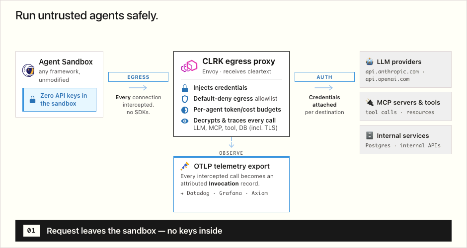

# CLRK

CLRK (we pronounce it as "clerk") is a Kubernetes-native runtime for LLM agents. It runs each agent
in a gVisor sandbox and transparently intercepts all egress - LLM APIs, MCP, tool calls - without
modifying agent code. That interception point gives you observability, policy enforcement, and
routing-based cost control over agents you don't otherwise get to see inside.

## How it works

CLRK runs untrusted, framework-agnostic agent workloads in [gVisor](https://gvisor.dev/) sandboxes.
You describe an agent declaratively - a container image + a trigger + an egress policy - and CLRK
schedules it onto a pool of sandbox workers. It brings its own scheduler, so agent startup isn't
gated on pod-creation latency. Every byte in or out of the sandbox passes through a transparent
proxy CLRK controls, so the platform sees and governs all LLM API calls, MCP traffic, and outbound
tool calls without the agent code being aware of it. Yes, that includes TLS-encrypted connections.

The agent inside can be anything that makes HTTP(S) calls - a Python script using the OpenAI or
Anthropic SDK, a Node MCP client, a shell one-liner. There is no required agent library; CLRK
intercepts at the network and process boundary. See [`_examples/`](_examples) for runnable agents
(`openai-bot`, `gemini-bot`, `cron-bot`, `jq-bot`, MITM variants, and more).

## Motivation

Running agents in production raises problems that general-purpose container
orchestration does not solve on its own. CLRK is built to address them directly:

- **Observability.** All I/O in and out of a sandbox is intercepted and logged, so
  LLM, MCP, and remote tool-call telemetry is auto-instrumented rather than bolted on
  per-framework.
- **Governance.** Prevent sandbox escape and apply organization-wide policy
  (where an agent may connect, what credentials it may use) at the egress boundary.
- **Attribution.** Tie agent loops back to the customer request or trigger that
  started them, captured as first-class `Invocation` records.
- **Zero-Trust Access.** Give agents audited, authorized access to internal services
  instead of all-or-nothing network access.
- **Scalability.** One model for both serverless bursts and long-lived "on-prem"
  Kubernetes fleets.
- **Reliability.** Simple, robust retries, load-shedding, all outside of the Kubernetes
  control plane.

A deliberate design choice that follows from governance: **credentials never live in
the agent.** API keys for AI providers, MCP servers, and internal services are
injected by the egress MITM at request time, never via pod env, mounts, or args - so
a compromised sandbox cannot exfiltrate them.

## Architecture

CLRK ships two long-running binaries plus a CLI:

- **`cmd/controller-manager`** - the control plane. Runs the
  controller-runtime reconcilers for the CRDs below and embeds an aggregated API
  server for the `clrk.apoxy.dev` group. Deployed as a Deployment on Kubernetes but
  can be run standalone. It also hosts UI dashboard.

- **`cmd/worker`** - Manages sandbox lifecycle via [gVisor](https://gvisor.dev)/`runsc`,
  sets up per-sandbox network interception via our custom [sentrystack plugin](https://pkg.go.dev/gvisor.dev/gvisor/pkg/sentry/socket/plugin/stack) to be
  routed through the interception path. Linux-only (`//go:build linux`, CGO).

- **`cmd/clrk`** - the operator/developer CLI: `install`, `upgrade`, `dev`,
  `apply`, `get`, `logs`, `traces`, `status`, `run-task`, context management, and a
  local-cluster dev loop.

**Egress interception.** Outbound traffic is captured transparently and sent through
an `EgressGateway` - an Envoy-based data plane with TLS termination (MITM) and a
custom filter. This is where telemetry is recorded, credentials are injected,
and routing/governance policies (`EgressL4Route`, `MCPRoute`, `AIProviderRoute`,
egress/credential/fallback-routing/logging/rate-limit policies) are applied.

**Telemetry storage and export.** Intercepted I/O becomes `Invocation` records
backed by ClickHouse (via the `ch-go` driver) and can be consumed using `/logs` and
`/traces` subresources as well as re-exported over OpenTelemetry sink.

**`TaskAgent` vs `DaemonAgent`**
`TaskAgent` is for triggered, run-to-completion work (HTTP request or cron) multiplexed
across shared worker pods. `DaemonAgent` is for long-lived agent processes with a
restart policy.

### APIs

| CRD | Purpose |
|---|---|
| `TaskAgent` | Short-lived agent execution (request → sandbox → response) |
| `DaemonAgent` | Long-lived agent process with restart policy |
| `WorkerPool` | Fleet of worker pods (Deployment + Service) |
| `EgressGateway` | Transparent egress proxy with TLS termination modes |
| `EgressL4Route` | L4 egress routing rules |
| `MCPRoute` | MCP protocol routing |
| `AIProviderRoute` | AI-provider-specific egress routing |
| `Invocation` | Attributed record of an intercepted agent call (ClickHouse-backed) |

### Repository layout

| Path | Contents |
|---|---|
| `api/clrk/v1alpha1/` | CRD types (Apache-2.0) |
| `client/` | Generated Kubernetes clientset, listers, informers (Apache-2.0) |
| `internal/controller/` | controller-runtime reconcilers |
| `internal/worker/`, `internal/sandbox/` | sandbox lifecycle (Linux-only) |
| `internal/eg*`, `internal/extproc/`, `internal/egress/` | Envoy egress data plane + interception |
| `internal/clickhouse/`, `internal/chwriter/`, `internal/otel*` | telemetry storage and export |
| `internal/install/`, `cmd/clrk/` | installer and CLI |
| `codegen/` | code-generator config (`update.sh`, header boilerplate) |

## FAQ

### Does my agent need to use a specific framework or SDK?

No. CLRK intercepts at the network and process boundary, so any agent that makes
HTTP/S calls works. The provided examples use the OpenAI and Gemini SDKs, plain
shell tools, and MCP clients.

### Where do API keys live?

Not in the agent. Credentials are injected by the egress MITM at request time via a
credential-injection policy - never in pod env, mounts, or args. A compromised
sandbox has no secrets to leak. The secret material iself is safe and sound in a
Kubernetes Secret.

### How is the sandbox isolated?

Sandboxes run via [gVisor](https://gvisor.dev) (`runsc`) for a stronger syscall
boundary, each in its own network namespace with all egress forced through the
interception path.

### Can I run it locally or do I need a Kubernetes cluster?

All batteries included! `clrk dev` brings up a local cluster and dev loop. This can
also be used to run CLRK without a Kubernetes cluster nearby. `clrk install` /
`clrk upgrade` manage a Kubernetes-based deployment.

### Why are `api/` and `client/` licensed differently from the rest?

So you can build against the API and use the generated client without AGPL copyleft
obligations. See [License](#license).

### Where is CONTRIBUTING.md?

Currently, external contributions are not accepted. If you encounter a bug or have a
feature request, please open an issue on the
[GitHub repository](https://github.com/apoxy-dev/clrk/issues).

### Was this tested? I can't find any tests!

We have tests, we swear! Currently they are coupled with our private build/test
infrastructure and are not publicly available. We try to maintain minimum 70% unit
test coverage and have integration tests for the public API.

### Was this vibe-coded?

We rely on AI-assist but every output line is carefully reviewed and tested before
being committed.

## License

CLRK is licensed under the **GNU Affero General Public License v3.0**
(AGPL-3.0); see [`LICENSE`](LICENSE).

**Exception:** the [`api/`](api) and [`client/`](client) directories are
licensed under the **Apache License 2.0**; see [`api/LICENSE`](api/LICENSE)
and [`client/LICENSE`](client/LICENSE). These cover the public API types
(`api/clrk/v1alpha1`) and the generated Kubernetes client/SDK, so they can be
imported and used without AGPL copyleft obligations.
